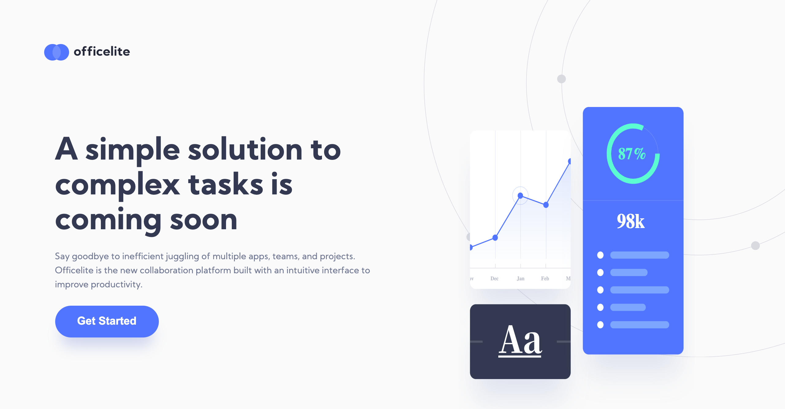

# Frontend Mentor - Officelite coming soon site solution

This is a solution to the [Officelite coming soon site challenge on Frontend Mentor](https://www.frontendmentor.io/challenges/officelite-coming-soon-site-M4DIPNz8g). Frontend Mentor challenges help you improve your coding skills by building realistic projects. 

## Table of contents

- [Overview](#overview)
  - [The challenge](#the-challenge)
  - [Screenshot](#screenshot)
  - [Built with](#built-with)
  - [Continued development](#continued-development)
- [Author](#author)

## Overview

### The challenge

Users should be able to:

- View the optimal layout for the site depending on their device's screen size
- See hover states for all interactive elements on the page
- See error states when the contact form is submitted if:
  - The `Name` and/or `Email Address` fields are empty
  - The `Email Address` is not formatted correctly
- **Bonus**: See a live countdown timer that ticks down every second
- **Bonus**: See a custom-styled `select` form control in the sign-up form

### Screenshot

### Links

- Solution URL: [https://github.com/charliepoker/Officelite-coming-soon-site/tree/main/starter-code](https://github.com/charliepoker/Officelite-coming-soon-site/tree/main/starter-code)
- Live Site URL: [https://officelite-coming-soon-site-eight.vercel.app/](https://officelite-coming-soon-site-eight.vercel.app/)

## My process

### Built with

- Semantic HTML5 markup
- CSS 
- Flexbox
- CSS Grid
- Mobile-first workflow
### What I learned

Developing mobile first websites. Also, I practiced flexbox skills during the transition from mobile design to the desktop design. 
### Continued development
Proper positioning of layouts while transitioning from mobile to desktop

## Author

- Website - [https://dev-acho.netlify.app/](https://dev-acho.netlify.app/)
- Frontend Mentor - [@charliepoker](https://www.frontendmentor.io/profile/yourusername)
- Twitter - [@**achor**](https://twitter.com/__achor__)

